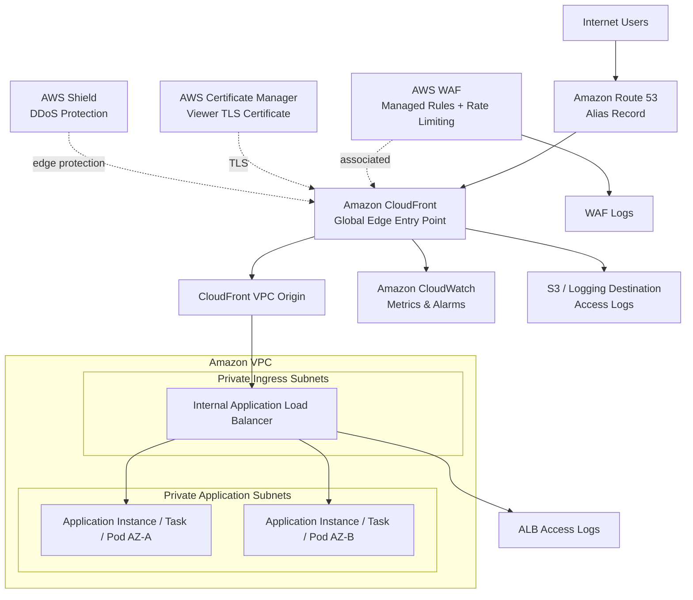

# AWS Production Architecture #01 — Secure Global Web Application Edge

**Route 53 → CloudFront → AWS WAF → Private ALB → Private Application Tier**

> A production-oriented reference architecture for exposing a web application globally while reducing origin exposure, filtering malicious HTTP traffic at the edge, enforcing TLS, improving observability, and keeping the application tier private.

---

## Executive summary

Putting an Application Load Balancer directly on the internet can work, but it also makes the origin itself a public attack surface. A stronger edge architecture places **Amazon CloudFront** in front of the workload, attaches **AWS WAF** at the distribution, uses **Amazon Route 53** for DNS, terminates modern TLS with **AWS Certificate Manager**, and keeps the application origin private whenever the workload and feature requirements allow it.

The resulting request path is:

```text
User
  ↓
Amazon Route 53
  ↓
Amazon CloudFront
  ↓
AWS WAF
  ↓
CloudFront VPC Origin
  ↓
Internal Application Load Balancer
  ↓
Private Application Tier
```

The point is not to add services for the sake of complexity. Each layer addresses a different concern:

- **Route 53** provides authoritative DNS and routing.
- **CloudFront** becomes the global application entry point, terminates viewer TLS, caches eligible content, and absorbs traffic at AWS edge locations.
- **AWS WAF** evaluates HTTP(S) requests before they reach the origin.
- **AWS Shield protections** help mitigate DDoS attacks against edge services; Shield Advanced can be added when the business case requires its additional capabilities and support model.
- **A private ALB** distributes only the traffic that has passed through the edge layer.
- **Private application subnets** keep compute nodes away from direct internet exposure.
- **CloudWatch and security logs** provide the telemetry needed to operate and investigate the platform.

This pattern is a good fit for public web applications, customer portals, APIs delivered through CloudFront, SaaS front ends, e-commerce workloads, and enterprise applications that need a controlled public entry point.

---

## Architecture



### Why the origin is private

CloudFront supports **VPC origins** for workloads hosted behind private VPC resources such as Application Load Balancers. This allows CloudFront to become the public entry point while the ALB and application remain in private subnets. That significantly reduces the number of internet-reachable components and makes bypassing the edge controls harder.

This architecture deliberately prefers that pattern over an internet-facing ALB when the application is compatible with VPC origins.

There are cases where an internet-facing ALB is still appropriate. If you must use one, harden it so clients cannot bypass CloudFront—for example by restricting inbound access using the CloudFront managed prefix list and validating a custom origin header. AWS documents both patterns.

---

## Request flow

A normal HTTPS request follows these steps:

1. A user requests `https://app.example.com`.
2. Route 53 resolves the application hostname to the CloudFront distribution using an alias record.
3. The client establishes TLS with CloudFront using a certificate issued or imported through ACM.
4. AWS WAF evaluates the request against the Web ACL.
5. Requests that match blocking rules are rejected at the edge.
6. Requests that are allowed are served from cache when possible.
7. Cache misses or dynamic requests are forwarded through the CloudFront VPC origin.
8. The internal ALB receives the origin request and distributes it across healthy application targets in multiple Availability Zones.
9. Application responses return through CloudFront to the client.
10. Metrics, access logs, WAF events, and load balancer telemetry feed the operational and security monitoring plane.

The key security property is that **the user never needs a network path directly to the application tier**.

---

## Security objectives

This design targets six practical security goals.

### 1. Reduce public attack surface

Only the edge endpoint needs to be internet-facing. The application load balancer and compute tier can remain private.

### 2. Block common web attacks before the origin

AWS WAF can inspect requests using managed rule groups and custom rules. Typical controls include:

- common web exploit protections;
- known bad input patterns;
- IP reputation controls;
- SQL injection and cross-site scripting detections;
- request-size restrictions;
- geo-based restrictions where justified;
- rate-based rules;
- application-specific allow/deny logic.

Managed rules should not simply be switched from `COUNT` to `BLOCK` without observation. Production teams should test and tune protections against real traffic to avoid false positives.

### 3. Mitigate abusive request rates

Rate-based WAF rules can throttle or block request sources that exceed application-specific thresholds. Useful examples include:

```text
/login
/password-reset
/search
/api/auth/*
/api/public/*
```

Different endpoints have different normal request profiles. A single global threshold is easy to configure but often too coarse for a serious production system.

### 4. Enforce encryption in transit

Use HTTPS from viewers to CloudFront and HTTPS from CloudFront to custom origins whenever supported by the selected origin pattern. Redirect HTTP viewers to HTTPS rather than serving sensitive content over plaintext.

### 5. Prevent origin bypass

A WAF attached only to CloudFront does not protect an origin that users can reach directly. The strongest control is to make the origin private with VPC origins. If the ALB is public, restrict it so only CloudFront-originated traffic is accepted.

### 6. Preserve evidence

Security controls without logs are difficult to operate. WAF logs, CloudFront access logs, ALB access logs, CloudWatch metrics, alarms, and centralized retention policies should be part of the architecture—not an afterthought.

---

## Threat model

| Threat | Example | Primary control | Residual consideration |
|---|---|---|---|
| Volumetric DDoS | Large floods against public endpoint | CloudFront + AWS Shield protections | Capacity and application-layer attacks still require layered controls |
| L7 request flood | High-rate requests to expensive endpoint | AWS WAF rate-based rules | Thresholds must be tuned to business traffic |
| SQLi/XSS probes | Malicious query/body patterns | WAF managed/custom rules | Application secure coding remains mandatory |
| Origin bypass | Attacker calls ALB directly | VPC origin + internal ALB | Public-origin alternatives need explicit restrictions |
| TLS downgrade / plaintext | Client uses HTTP | Redirect-to-HTTPS + modern TLS policy | Legacy clients may require deliberate compatibility choices |
| Bot abuse | Credential stuffing, scraping | WAF rules; optional Bot Control | Advanced bot controls can add cost |
| App compromise | Vulnerability passes edge rules | Private tier, IAM, patching, app security | WAF is not a substitute for application security |
| Credential abuse | Stolen AWS credentials | IAM least privilege, MFA, detection | Separate from request-path controls |
| Logging blind spot | Attack occurs without usable evidence | WAF/CloudFront/ALB logs + CloudWatch | Retention and centralized analysis must be designed |

---

## AWS WAF policy strategy

A production Web ACL should be intentionally layered. One possible rule order is:

```text
Priority 10   Explicit trusted exceptions (very narrow)
Priority 20   Known malicious / reputation controls
Priority 30   AWS managed baseline rule groups
Priority 40   Application-specific exploit rules
Priority 50   Sensitive endpoint rate limiting
Priority 60   General rate limiting
Priority 70   Geo controls if required by the business
Default       Allow
```

For a new workload, a safer rollout is:

```text
COUNT → observe → tune exclusions → BLOCK
```

Do not blindly copy rate thresholds between applications. A login endpoint, static asset path, GraphQL endpoint, and image API can have radically different valid traffic patterns.

### WAF at CloudFront vs WAF at ALB

For this architecture, the primary Web ACL sits at **CloudFront**, allowing bad requests to be rejected before they traverse toward the origin.

In some environments a second Web ACL at the ALB can provide defense in depth, especially when the origin also serves non-CloudFront traffic. However, duplicate controls increase cost and operational complexity. The architecture should be driven by real access paths and threat requirements.

---

## DDoS protection: Shield Standard and Shield Advanced

AWS edge services include built-in DDoS protections. CloudFront and Route 53 benefit from AWS's distributed edge infrastructure and Shield mitigation capabilities.

**AWS Shield Advanced should not be treated as a mandatory checkbox for every application.** It is a business and risk decision. It becomes more compelling for high-value internet applications that require enhanced DDoS visibility, advanced protections, cost-protection considerations, and access to the AWS DDoS Response Team under the applicable service model.

A mature architecture document should therefore separate:

```text
Baseline architecture: CloudFront + Route 53 + AWS WAF
Risk-driven enhancement: AWS Shield Advanced
```

That distinction is important for both architecture quality and FinOps.

---

## High availability and failure domains

The application tier should span at least two Availability Zones:

```text
Private subnet AZ-A → application target(s)
Private subnet AZ-B → application target(s)
                   ↑
             Internal ALB
```

The ALB health checks should represent actual application health, not merely whether a TCP port is open. For example:

```text
/health/ready
```

should validate the minimum dependencies required to safely receive traffic.

CloudFront improves resilience at the edge, but it does not magically make an unhealthy single-AZ application highly available. The origin architecture must still tolerate instance, task, node, and Availability Zone failures.

For workloads with cacheable content and higher resilience requirements, evaluate **CloudFront Origin Shield**. It adds another caching layer that can improve cache hit ratio and reduce simultaneous requests reaching the origin. It is useful when those benefits justify the additional cost.

---

## TLS and certificate design

For custom CloudFront hostnames, viewer certificates have specific AWS regional requirements. Build certificate lifecycle management into the platform instead of treating certificates as a manual deployment task.

Recommended controls:

- use a custom ACM certificate for the public application hostname;
- redirect HTTP viewers to HTTPS;
- select a modern CloudFront security policy compatible with the client population;
- use HTTPS from CloudFront to the origin where applicable;
- monitor certificate expiration for any certificate not automatically renewed;
- avoid sharing private keys outside controlled certificate workflows.

---

## DNS design with Route 53

The public DNS record should normally be an alias to CloudFront:

```text
app.example.com  →  CloudFront distribution
```

This keeps the application hostname stable while the underlying edge infrastructure remains managed by AWS.

Route 53 health checks are not a replacement for application monitoring. DNS, CDN, load balancer, application, dependency, and synthetic monitoring answer different questions and should be treated as separate observability signals.

---

## Observability

At minimum, monitor four layers.

### CloudFront

Watch:

- total requests;
- 4xx error rate;
- 5xx error rate;
- cache hit rate;
- bytes transferred;
- origin latency trends.

### AWS WAF

Watch:

- allowed requests;
- blocked requests;
- rule matches;
- rate-limit events;
- sudden country/IP/URI shifts;
- false-positive patterns after rule changes.

### Application Load Balancer

Watch:

- healthy host count;
- unhealthy host count;
- target response time;
- HTTP 4xx/5xx by load balancer and targets;
- rejected connections;
- request count.

### Application

Infrastructure metrics alone are insufficient. Add:

- application latency percentiles;
- error rates;
- dependency latency;
- business transaction success metrics;
- distributed traces where useful;
- synthetic checks from outside the VPC.

A useful operational principle is:

> **Alert on user impact and exhausted error budgets, not on every metric that happens to move.**

---

## Logging strategy

A security-oriented deployment should define log destinations, retention, access controls, and query workflows before go-live.

Recommended sources:

```text
CloudFront access logs
AWS WAF logs
ALB access logs
Application logs
CloudTrail management events
VPC Flow Logs where justified
```

Logs should be protected against casual modification, encrypted according to organizational policy, and retained according to legal/security requirements.

For higher-volume environments, consider a centralized logging account and security analytics pipeline rather than leaving evidence distributed across workload accounts.

---

## IAM and operational access

The request path is only one part of the threat model. The AWS control plane must also follow least privilege.

Recommended practices include:

- human access through federation and MFA;
- short-lived credentials instead of long-lived IAM user keys;
- separate deployment and runtime roles;
- least-privilege permissions for CI/CD;
- no SSH/RDP exposure simply for routine administration;
- Systems Manager or other controlled management paths where applicable;
- CloudTrail enabled and centrally retained.

---

## Network segmentation

A clean VPC layout might look like:

```text
VPC
├── Private ingress subnets
│   └── Internal ALB
├── Private application subnets
│   ├── App targets AZ-A
│   └── App targets AZ-B
└── Private data subnets
    └── Database / cache where applicable
```

Security groups should express workload relationships, not broad network trust.

Conceptually:

```text
CloudFront VPC-origin path → ALB
ALB security group         → application security group
Application security group → only required data/dependency ports
```

Avoid rules such as `0.0.0.0/0` to internal application ports simply because they make troubleshooting easier.

---

## Caching strategy

CloudFront is not only a security layer. Correct caching can materially reduce latency, origin load, and cost.

Separate behaviors by content type:

```text
/static/*     → long TTL, versioned assets
/images/*     → cacheable where safe
/api/public/* → short/selective caching if semantics allow
/api/user/*   → typically no shared caching unless explicitly designed
```

Cache keys should include only the headers, cookies, and query strings that genuinely vary the response. Forwarding everything usually destroys cache efficiency.

Do not cache personalized or sensitive responses unless the application has been specifically designed for it.

---

## Cost architecture

The exact monthly bill depends on region, traffic volume, request count, WAF rules, logging volume, Shield Advanced adoption, origin compute, and data transfer patterns.

The main cost drivers in this edge layer are typically:

| Component | Main cost driver |
|---|---|
| CloudFront | Requests + data transfer + optional features |
| AWS WAF | Web ACL/rules + request volume + paid managed features |
| Route 53 | Hosted zones + DNS queries + optional health checks |
| ALB | Running hours + Load Balancer Capacity Units |
| Logging | Ingestion, storage, queries, retention |
| Shield Advanced | Subscription and protected-resource model where applicable |

FinOps decisions should be architectural decisions. Examples:

- tune CloudFront caching to reduce origin load;
- avoid enabling paid WAF features without a threat-driven reason;
- control verbose security logging retention intelligently;
- size application targets based on observed demand;
- evaluate Origin Shield only when its cache/origin benefits justify the price;
- treat Shield Advanced as a risk decision, not as résumé architecture decoration.

---

## Architecture decisions

### ADR-001 — CloudFront is the public application entry point

**Decision:** Users access the workload through CloudFront rather than directly through the ALB.

**Why:** Global edge delivery, WAF integration, DDoS-resilient edge architecture, centralized TLS policy, caching, and reduced origin exposure.

**Trade-off:** Additional service configuration and cost.

### ADR-002 — Use a private origin when compatible

**Decision:** Prefer CloudFront VPC origins with an internal ALB.

**Why:** Prevent direct internet access to the load balancer.

**Trade-off:** Some CloudFront/VPC-origin feature restrictions must be validated against workload requirements.

### ADR-003 — WAF rules are tuned before blocking

**Decision:** New or materially changed rules begin in observation/count mode when practical.

**Why:** Reduce production false positives.

**Trade-off:** Malicious patterns may initially be observed rather than blocked during the tuning window.

### ADR-004 — Multi-AZ origin

**Decision:** Application targets span multiple Availability Zones.

**Why:** Avoid turning CloudFront into a resilient front end for a fragile single-AZ backend.

**Trade-off:** Additional compute and architecture cost.

### ADR-005 — Security telemetry is mandatory

**Decision:** WAF, edge, load balancer, and application telemetry is part of the baseline.

**Why:** Detection, incident response, tuning, capacity management, and auditability all depend on evidence.

**Trade-off:** Logging generates storage and analytics cost.

---

## Deployment sequence

A practical implementation sequence is:

```text
1. Create VPC and private subnets across multiple AZs
2. Deploy application targets
3. Deploy internal ALB and target groups
4. Validate ALB health internally
5. Create CloudFront VPC origin
6. Create CloudFront distribution
7. Request/validate ACM certificate
8. Attach custom domain to CloudFront
9. Create AWS WAF Web ACL in the required scope
10. Add managed and rate-based rules in COUNT mode
11. Associate WAF with CloudFront
12. Configure Route 53 alias record
13. Enable access/security logs
14. Create CloudWatch dashboards and alarms
15. Run functional, load, security, and failover tests
16. Tune WAF and move validated rules to BLOCK
```

---

## Production validation checklist

Before go-live, validate:

- [ ] `app.example.com` resolves to CloudFront.
- [ ] HTTP redirects to HTTPS.
- [ ] TLS policy meets organizational requirements.
- [ ] The origin cannot be accessed directly from the public internet.
- [ ] ALB targets are healthy in at least two Availability Zones.
- [ ] WAF managed rules have been observed and tuned.
- [ ] Rate limits are tested against expected peak traffic.
- [ ] CloudFront 4xx/5xx metrics are visible.
- [ ] ALB target 5xx and latency metrics are visible.
- [ ] WAF logs are searchable.
- [ ] Access logs have a defined retention policy.
- [ ] Application health checks reflect actual readiness.
- [ ] IAM deployment permissions are least privilege.
- [ ] Rollback steps are documented.
- [ ] Load testing has been performed through the real CloudFront hostname.
- [ ] Direct-origin bypass testing has been performed.
- [ ] Cost expectations have been reviewed before production launch.

---

## Common architecture mistakes

### Mistake 1 — Putting CloudFront in front of a public ALB but leaving the ALB open to everyone

This lets attackers bypass CloudFront and WAF controls.

### Mistake 2 — Enabling every WAF rule in BLOCK mode on day one

False positives can become an availability incident.

### Mistake 3 — Calling the architecture “highly available” because CloudFront is global

If the application only runs in one AZ, the origin still has a major failure domain.

### Mistake 4 — Forwarding all cookies, headers, and query strings

This can destroy cache hit ratio and unnecessarily increase origin traffic.

### Mistake 5 — Treating WAF as an application security replacement

WAF reduces risk; it does not remove the need for secure coding, patching, identity controls, dependency management, and testing.

### Mistake 6 — Ignoring the cost of logs

High-volume WAF, access, and application logs can become a meaningful cost line. Retention and analytics must be intentional.

---

## When I would modify this architecture

I would change the pattern for workloads such as:

- applications requiring protocols or features unsupported by CloudFront VPC origins;
- globally active-active applications with origins in multiple regions;
- API-first platforms better fronted by Amazon API Gateway;
- Kubernetes-native ingress designs with specialized routing requirements;
- workloads using Global Accelerator for non-HTTP protocols or specific network behavior;
- architectures requiring multi-region state, database replication, or regional evacuation.

The correct architecture depends on failure objectives, traffic profile, security requirements, protocol behavior, compliance, and cost—not on maximizing the number of AWS icons.

---

## Terraform

A Terraform starting point is included under:

```text
terraform/01-secure-global-web-application-edge/
```

The code is intentionally a **reference baseline**, not a copy-paste promise of production readiness. Production deployments still need environment-specific networking, state management, provider/version pinning, IAM boundaries, logging destinations, DNS ownership, certificates, WAF tuning, CI/CD controls, and testing.

---

## AWS documentation references

Primary AWS documentation used for this architecture:

- CloudFront — Restrict access with VPC origins: https://docs.aws.amazon.com/AmazonCloudFront/latest/DeveloperGuide/private-content-vpc-origins.html
- CloudFront — Restrict access to Application Load Balancers: https://docs.aws.amazon.com/AmazonCloudFront/latest/DeveloperGuide/restrict-access-to-load-balancer.html
- CloudFront — Configure secure access and restrict access to content: https://docs.aws.amazon.com/AmazonCloudFront/latest/DeveloperGuide/SecurityAndPrivateContent.html
- CloudFront — Origin Shield: https://docs.aws.amazon.com/AmazonCloudFront/latest/DeveloperGuide/origin-shield.html
- AWS WAF — Configuring Web ACL protection: https://docs.aws.amazon.com/waf/latest/developerguide/web-acl.html
- AWS WAF — Rate-based rules: https://docs.aws.amazon.com/waf/latest/developerguide/waf-rule-statement-type-rate-based.html
- AWS WAF — Using AWS WAF with CloudFront: https://docs.aws.amazon.com/waf/latest/developerguide/cloudfront-features.html
- AWS WAF — Best practices for intelligent threat mitigation: https://docs.aws.amazon.com/waf/latest/developerguide/waf-managed-protections-best-practices.html
- AWS Shield — CloudFront and Route 53 mitigation logic: https://docs.aws.amazon.com/waf/latest/developerguide/ddos-event-mitigation-logic-continuous-inspection.html
- AWS Security Hub — CloudFront security controls: https://docs.aws.amazon.com/securityhub/latest/userguide/cloudfront-controls.html

---

## Final takeaway

A production web edge should not be designed as simply:

```text
Internet → ALB → Servers
```

A more defensible architecture separates responsibilities:

```text
DNS
 ↓
Global edge
 ↓
HTTP security controls
 ↓
Private ingress
 ↓
Private application tier
 ↓
Observable and auditable operations
```

That separation reduces attack surface, gives security teams control before traffic reaches the workload, improves resilience, and creates a platform that can be tuned as the application grows.

---

**Author:** Juan Gutierrez  
**Series:** AWS Production Architecture Series  
**Article:** #01 — Secure Global Web Application Edge
